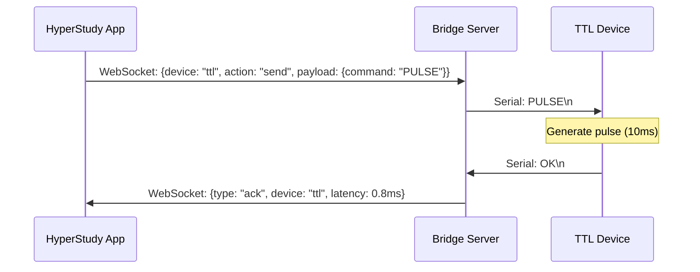

# TTL Pulse Generator Protocol Documentation

## Overview

The TTL (Transistor-Transistor Logic) Pulse Generator is a hardware device that generates precise digital pulses for synchronizing experimental equipment. In the HyperStudy Bridge system, it's primarily used with Adafruit RP2040-based devices to trigger events with sub-millisecond precision.

## Hardware Requirements

- **Device**: Adafruit RP2040 or compatible microcontroller
- **Connection**: USB Serial (CDC - Communications Device Class)
- **Voltage Levels**: 3.3V or 5V TTL logic levels
- **Pulse Duration**: Configurable, default 10ms
- **Latency Requirement**: <1ms from command to pulse generation

## Serial Communication Protocol

### Connection Parameters

| Parameter | Value |
|-----------|-------|
| Baud Rate | 115200 (default) |
| Data Bits | 8 |
| Stop Bits | 1 |
| Parity | None |
| Flow Control | None |

### Command Format

Commands are sent as ASCII text strings terminated with a newline character (`\n`).

#### Primary Commands

1. **PULSE** - Generate a single TTL pulse
   ```
   Command: PULSE\n
   Response: OK\n (on success) or ERROR:<message>\n (on failure)
   ```

2. **STATUS** - Query device status
   ```
   Command: STATUS\n
   Response: READY\n or BUSY\n
   ```

3. **CONFIG** - Configure pulse parameters
   ```
   Command: CONFIG:<duration_ms>\n
   Example: CONFIG:20\n (set pulse duration to 20ms)
   Response: OK\n or ERROR:<message>\n
   ```

4. **VERSION** - Get firmware version
   ```
   Command: VERSION\n
   Response: TTL_GEN_V1.0\n
   ```

### Response Format

All responses follow the pattern:
- Success: `OK\n` or specific data followed by `\n`
- Error: `ERROR:<error_message>\n`

## Implementation Details

### Software Architecture

```rust
pub struct TtlDevice {
    port: Option<Mutex<Box<dyn SerialPort>>>,
    port_name: String,
    status: DeviceStatus,
    config: TtlConfig,
    performance_callback: Option<PerformanceCallback>,
}
```

### Connection Flow

1. **Discovery**: Enumerate available serial ports
2. **Connection**: Open serial port with specified parameters
3. **Initialization**: Clear buffers and verify device responds
4. **Ready State**: Device ready to receive commands

### Command Execution Flow



### Performance Monitoring

The TTL module includes built-in performance monitoring to ensure sub-millisecond latency requirements are met:

```rust
pub fn set_performance_callback<F>(&mut self, callback: F)
where
    F: Fn(&str, Duration, u64, u64) + Send + Sync + 'static
```

Metrics tracked:
- **Command Latency**: Time from send() call to completion
- **Bytes Sent**: Number of bytes transmitted
- **Bytes Received**: Number of bytes in response
- **Success Rate**: Percentage of successful commands

## Error Handling

### Common Error Conditions

| Error Code | Description | Recovery Action |
|------------|-------------|-----------------|
| `NotConnected` | Device not connected | Call connect() first |
| `SerialError` | Serial port error | Check port availability |
| `CommunicationError` | Read/write failure | Retry or reconnect |
| `Timeout` | No response within 100ms | Check device power/connection |
| `InvalidPort` | Port doesn't exist | Verify port name |

### Reconnection Strategy

1. **Automatic Retry**: 3 attempts with exponential backoff
2. **Backoff Schedule**: 100ms, 500ms, 1000ms
3. **Status Updates**: Bridge notifies clients of connection status changes

## Testing

### Unit Tests

Located in `src-tauri/src/devices/ttl_tests.rs`

- Configuration validation
- Connection state management
- Error handling
- Performance callback verification

### Integration Tests

Requires physical hardware or mock serial port:

```bash
# Run with hardware connected
cargo test --features integration-tests -- --ignored

# Run specific TTL tests
cargo test ttl_tests --features integration-tests
```

### Performance Benchmarks

```bash
# Run performance benchmarks
cargo bench --bench ttl_performance
```

Expected results:
- Command latency: <1ms (99th percentile)
- Throughput: >100 commands/second
- Memory usage: <1MB per device connection

## Firmware Requirements

The microcontroller firmware must implement:

1. **USB CDC Serial Interface**: Standard serial communication
2. **Command Parser**: ASCII command interpretation
3. **GPIO Control**: TTL pulse generation on output pin
4. **Timing Precision**: Microsecond-accurate pulse duration
5. **Buffer Management**: Handle rapid command sequences

Example Arduino sketch for RP2040:

```cpp
void setup() {
    Serial.begin(115200);
    pinMode(TTL_PIN, OUTPUT);
    digitalWrite(TTL_PIN, LOW);
}

void loop() {
    if (Serial.available()) {
        String cmd = Serial.readStringUntil('\n');
        if (cmd == "PULSE") {
            digitalWrite(TTL_PIN, HIGH);
            delayMicroseconds(PULSE_DURATION_US);
            digitalWrite(TTL_PIN, LOW);
            Serial.println("OK");
        } else if (cmd == "STATUS") {
            Serial.println("READY");
        }
    }
}
```

## WebSocket Bridge Integration

### Command Structure

```json
{
    "type": "command",
    "device": "ttl",
    "action": "send",
    "payload": {
        "command": "PULSE"
    },
    "id": "req-123"
}
```

### Response Structure

```json
{
    "type": "ack",
    "device": "ttl",
    "payload": {
        "success": true,
        "latency_ms": 0.8,
        "timestamp": 1699123456789
    },
    "id": "req-123"
}
```

## Security Considerations

1. **Local Only**: Serial ports are local hardware, no network exposure
2. **Input Validation**: All commands validated before transmission
3. **Rate Limiting**: Maximum 1000 commands/second to prevent abuse
4. **Error Isolation**: Serial errors don't affect other devices

## Troubleshooting

### Device Not Found

1. Check USB cable connection
2. Verify device appears in system:
   - macOS: `ls /dev/tty.*`
   - Linux: `ls /dev/ttyUSB*` or `ls /dev/ttyACM*`
   - Windows: Device Manager → Ports (COM & LPT)

### Permission Denied

**Linux/macOS**:
```bash
# Add user to dialout group (Linux)
sudo usermod -a -G dialout $USER

# Set port permissions (temporary)
sudo chmod 666 /dev/ttyUSB0
```

### High Latency

1. Check USB hub - connect directly to computer
2. Disable power management for USB ports
3. Verify no other applications using the port
4. Check system load and CPU throttling

## Future Enhancements

1. **Batch Commands**: Send multiple pulses with precise timing
2. **Pattern Generation**: Programmable pulse sequences
3. **Multi-Channel**: Support multiple TTL outputs
4. **Hardware Triggering**: External trigger input support
5. **Pulse Width Modulation**: Variable duty cycle support

## References

- [USB CDC Class Specification](https://www.usb.org/document-library/class-definitions-communication-devices-12)
- [RS-232 Serial Communication](https://en.wikipedia.org/wiki/RS-232)
- [TTL Logic Levels](https://en.wikipedia.org/wiki/Transistor%E2%80%93transistor_logic)
- [Adafruit RP2040 Documentation](https://learn.adafruit.com/adafruit-feather-rp2040-pico)